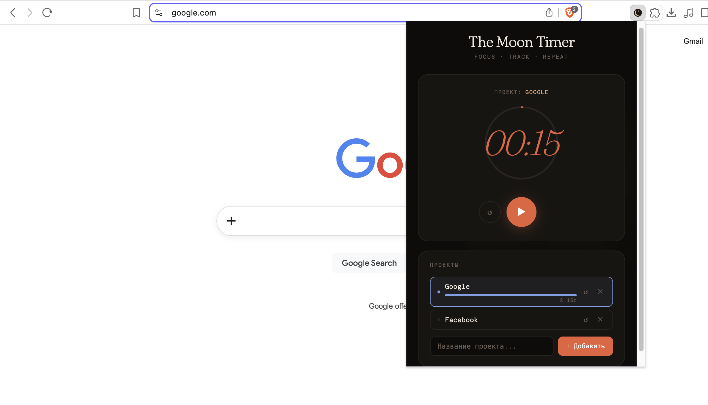

# 🌕 The Moon Timer

A minimalist focus timer with project tracking — built as a Chrome extension.

Counts up from zero, saves time per project, and keeps running in the background even when the popup is closed.

---

## Features

- **Stopwatch-style timer** — counts up from 0:00, no countdown pressure
- **Project tracking** — create projects, select one, and all work time is saved to it
- **Runs in the background** — close the popup, timer keeps going
- **Visual progress ring** — fills up over 60 minutes
- **Work / Break modes** — switch between focus and rest
- **Per-project time bars** — see at a glance where your time goes
- **Reset time per project** — individually clear any project's history
- **Desktop notifications** — get notified after 60 minutes of focus
- **Dark UI** — easy on the eyes during long work sessions

---

## Installation

> The Moon Timer is not yet on the Chrome Web Store. Install it manually in a few steps — it's easy.

### Step 1 — Download

Go to the [**Releases**](../../releases) page and download `moon-timer.zip` from the latest release.

### Step 2 — Unpack

Unzip the downloaded file. You'll get a folder called `moon-timer`.

### Step 3 — Load in Chrome

1. Open Chrome and go to `chrome://extensions/`
2. Enable **Developer mode** using the toggle in the top-right corner
3. Click **"Load unpacked"**
4. Select the `moon-timer` folder

The 🌕 icon will appear in your Chrome toolbar. Click it to open the timer.

---

## How to use

1. **Add a project** — type a name in the input field and press Enter or click "+ Add"
2. **Select a project** — click on it to make it active (highlighted in blue)
3. **Start the timer** — click ▶ to begin, the timer counts your work time
4. **Pause** — click ⏸ to pause; time is automatically saved to the active project
5. **Switch projects** — click another project; elapsed time saves to the current one first
6. **Reset project time** — click ↺ next to a project to clear its accumulated time
7. **Work / Break** — use the mode buttons at the top to switch between focus and rest

---

## Updating

When a new version is released:

1. Download the new `moon-timer.zip` from [Releases](../../releases)
2. Unzip and replace your existing `moon-timer` folder
3. Go to `chrome://extensions/` and click the **refresh icon** on The Moon Timer card

---

## Browser support

| Browser | Supported |
|---------|-----------|
| Chrome 102+ | ✅ |
| Edge (Chromium) | ✅ |
| Brave | ✅ |
| Opera | ✅ |
| Firefox | ❌ (different extension API) |
| Safari | ❌ |

---

## Privacy

No data is collected, stored remotely, or transmitted anywhere. All timer and project data lives in your browser's local session storage and never leaves your device.

---

## License

MIT — free to use, modify, and distribute.
